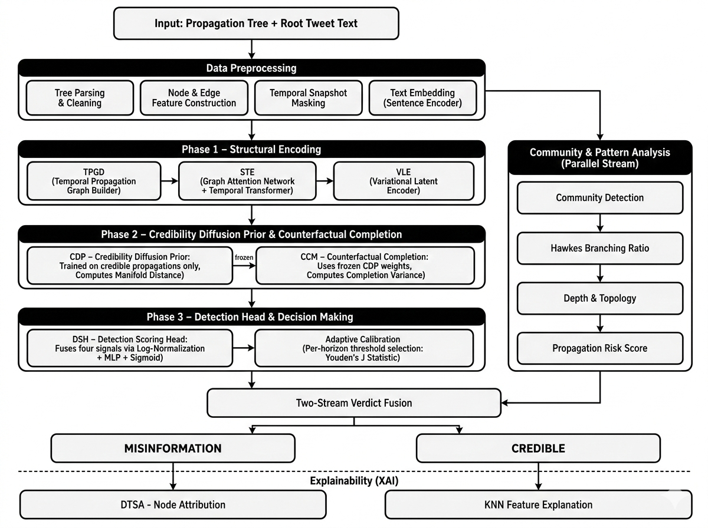

# Twitter Misinformation Detection through Spatio-Temporal Propagation Pattern Analysis

[](https://www.python.org/)
[](https://pytorch.org/)
[](https://pytorch-geometric.readthedocs.io/)
[](https://www.sbert.net/)
[](https://streamlit.io/)
[](https://scikit-learn.org/)

A deep learning system that classifies social media claims as **MISINFORMATION** or **CREDIBLE** by analysing *how* a claim spreads through a retweet propagation tree over time — rather than relying on the tweet's textual content alone. The pipeline encodes the propagation tree across multiple temporal snapshots using a Graph Attention Network (GAT) and Temporal Transformer, fuses this with tweet text embeddings via a Variational Autoencoder (VAE), and compares the resulting latent representation against a credibility manifold learned by a Denoising Diffusion Probabilistic Model (DDPM) trained exclusively on verified credible cascades. A parallel community analysis stream detects coordinated amplification using Hawkes process branching ratio estimation, and a dual-module explainability layer makes every verdict auditable.

**Benchmark results (Twitter15):** AUC 0.865 · 87.1% precision at full propagation · 97.1% precision at the 60-minute early-detection horizon · AUC stable within 1.5% across all detection windows from 1 minute to full propagation.

> This project underpins a patent application currently in preparation. Please do not reuse or redistribute the methodology without permission until the filing status is confirmed with the project supervisor.

---

## Table of Contents
- [Architecture](#architecture)
- [Key Components](#key-components)
- [Tech Stack](#tech-stack)
- [Project Structure](#project-structure)
- [Dataset](#dataset)
- [Workflow](#workflow)
- [Installation & Setup](#installation--setup)
- [Data Preprocessing](#data-preprocessing)
- [Training the Model](#training-the-model)
- [Evaluation, Calibration & Ablation](#evaluation-calibration--ablation)
- [Running the Streamlit App](#running-the-streamlit-app)
- [Results](#results)
- [Configuration](#configuration)
- [Notes on Excluded Files](#notes-on-excluded-files)

---

## Architecture



---

## Key Components

### Structural Encoding
- **TPGB (Temporal Propagation Graph Builder)** — transforms the raw retweet tree into 5 temporally ordered graph snapshots (15 min, 30 min, 45 min, 60 min, 120 min), preserving both topology and interaction timing
- **STE (Spatio-Temporal Encoder)** — a Graph Attention Network (4-head, 2-layer, residual, dual mean/max pooling) applied per snapshot, followed by a Temporal Transformer (2 heads, 2 layers) that attends across the snapshot sequence
- **VLE (Variational Latent Encoder)** — fuses the spatio-temporal graph embedding with a 384-dim sentence embedding of the root tweet into a probabilistic latent space (μ, σ²) via reparameterisation

### Credibility Diffusion Prior
- **CDP (Credibility Diffusion Prior)** — a Denoising Diffusion Probabilistic Model (1000-step, cosine schedule) trained **exclusively on credible propagation cascades**, learning the structure of the credibility manifold. At inference, computes the **Manifold Distance (d_m)** of an unseen claim
- **CCM (Counterfactual Completion Module)** — uses the frozen CDP to sample 10 possible future propagation states for a partially observed cascade, producing the **Completion Variance (d_cv)** as an unpredictability signal

### Detection & Decision
- **DSH (Detection Scoring Head)** — fuses Manifold Distance, Completion Variance, Temporal Velocity (d_tr), and Posterior Variance (σ²z) via log-normalisation + MLP + sigmoid into a single detection score
- **Adaptive Calibration** — selects the classification threshold independently per time horizon using Youden's J statistic, enabling reliable early detection from 1 minute to full propagation

### Community & Pattern Analysis (parallel stream)
- Modularity-based community detection (Louvain) for echo chamber identification
- Hawkes self-exciting process branching ratio estimation for coordinated burst detection
- Tree depth/topology analysis and an integrated LOW/MODERATE/HIGH propagation risk score

### Explainability
- **DTSA** — perturbation/gradient-based node attribution identifying which users drove the verdict
- **KNN Feature Explanation** — retrieves the most structurally similar past claims from the latent space with a feature-by-feature signal breakdown
- **PPA (Propagation Pattern Analyzer)** — a rule-based, non-learned module that computes six interpretable propagation pattern features directly from the graph (Burst Score, Decay Rate, Peak Timing, Depth-to-Width Ratio, Cascade Density, Root Dominance), producing human-readable flags (e.g. *"HIGH BURST: 68% of propagation occurred in the first 20% of the time window"*) and an overall pattern verdict (ORGANIC / MILDLY SUSPICIOUS / SUSPICIOUS / HIGHLY SUSPICIOUS). Used to power the Streamlit visualisation and to characterise *how* a claim spreads independently of the DSH's binary output

---

## Tech Stack

| Layer | Technology |
|:---|:---|
| Deep Learning | PyTorch 2.6, PyTorch Geometric 2.7 (+ torch_cluster, torch_scatter, torch_sparse, torch_spline_conv) |
| Text Embeddings | Sentence-Transformers 5.2, Hugging Face Transformers 5.1 |
| Graph & Community Analysis | NetworkX |
| Classical ML / Metrics | scikit-learn, SciPy |
| App / UI | Streamlit, Plotly, Matplotlib |
| Data | NumPy, Pandas |

---

## Project Structure

```text
dl_project/
├── backend
│   ├── checkpoints/              # Trained model weights (excluded — see below)
│   ├── configs/
│   │   └── config.yaml           # Model & training hyperparameters
│   ├── data/
│   │   ├── parse_raw.py          # Parses raw Twitter15/16 tree + label files
│   │   ├── build_graphs.py       # Builds propagation graphs from parsed data
│   │   ├── propagation_simulator.py
│   │   ├── embed_texts.py        # Sentence-embeds root tweet text
│   │   ├── make_splits.py        # Train/val/test split generation
│   │   ├── dataset_loader.py     # PyG dataset/dataloader wrapper
│   │   ├── graph_data.py         # Graph data structure definitions
│   │   ├── inspect_dataset.py    # Dataset inspection utility
│   │   ├── stats_scan.py         # Dataset statistics scanning
│   │   ├── verify_processed.py   # Sanity-checks processed output
│   │   ├── test_parse_raw.py
│   │   └── test_dataset_loader.py
│   ├── models/
│   │   ├── tpgb.py                # Temporal Propagation Graph Builder
│   │   ├── ste.py                 # Spatio-Temporal Encoder (GAT + Temporal Transformer)
│   │   ├── vle.py                 # Variational Latent Encoder
│   │   ├── cdp.py                 # Credibility Diffusion Prior (DDPM)
│   │   ├── ccm.py                 # Counterfactual Completion Module
│   │   ├── dsh.py                 # Detection Scoring Head
│   │   ├── adaptive_scorer.py     # Per-horizon Youden's J calibration
│   │   ├── community_analysis.py  # Louvain + Hawkes + topology + risk scoring
│   │   ├── dtsa.py                # Node attribution (XAI)
│   │   └── ppa.py                 # Propagation Pattern Analyzer — rule-based burst/decay/
│   │                              #   topology feature extraction for XAI + visualization
│   ├── training/
│   │   ├── phase1_encoder.py      # Stage 1 — STE + VLE training
│   │   ├── phase2_diffusion.py    # Stage 2 — CDP pre-training (credible-only)
│   │   └── phase3_joint.py        # Stage 3 — end-to-end DSH training (frozen CDP)
│   └── evaluation/
│       ├── evaluate.py            # Full evaluation across horizons
│       ├── calibrate.py           # Per-horizon threshold calibration
│       └── ablation.py            # Component ablation study
├── dataset/                       # Twitter15 / Twitter16 raw + processed data (excluded)
├── results/
│   ├── evaluation_results.json
│   ├── calibration.json
│   └── ablation_results.json
├── requirements.txt
└── streamlit_app.py                # Interactive demo / inference UI
```

---

## Dataset

The system is trained and evaluated on **Twitter15** and **Twitter16**, the standard public benchmark datasets for propagation-based rumour/misinformation detection, originally released alongside:

> Jing Ma, Wei Gao, Kam-Fai Wong. *Rumor Detection on Twitter with Tree-structured Recursive Neural Networks.* ACL 2018.

| Dataset | Source Tweets | Total Posts (incl. retweets/replies) |
|:---|---:|---:|
| Twitter15 | 1,490 | 331,612 |
| Twitter16 | 818 | 204,820 |

Each source tweet is labelled `true rumor`, `false rumor`, `unverified`, or `non-rumor` based on cross-referencing with fact-checking organisations. For this project, labels are mapped to a binary task: `false rumor` → **MISINFORMATION**, `true rumor` → **CREDIBLE**.

**Download the raw data:**
- Official repository (source code + `resource/` folder with pre-processed files): [majingCUHK/Rumor_RvNN](https://github.com/majingCUHK/Rumor_RvNN)
- Raw dataset archive: `rumdetect2017.zip` (linked from the repository above and mirrored across several rumor-detection research repos)

Since `dataset/` is excluded from this repository (see [Notes on Excluded Files](#notes-on-excluded-files)), you will need to download the raw data yourself and run the preprocessing pipeline described below to reproduce the `dataset/processed/` structure this project expects:

```
dataset/
├── raw/
│   ├── twitter15/
│   │   ├── tree/
│   │   ├── splits/
│   │   ├── label.txt
│   │   └── source_tweets.txt
│   └── twitter16/  (same structure)
└── processed/
    ├── twitter15/
    │   ├── graphs/
    │   ├── dataset_stats.json
    │   └── text_embeddings.pt
    └── twitter16/  (same structure)
```

---

## Workflow

1. **Input** — a claim's root tweet text and its full propagation tree (who retweeted/replied, to whom, and when) are provided as input.
2. **Preprocessing** — the tree is parsed and cleaned, node/edge features are constructed, 5 temporal snapshots are built, and the root tweet text is embedded via a sentence transformer.
3. **Structural encoding** — TPGB's snapshot sequence is passed through STE (GAT + Temporal Transformer) to produce a spatio-temporal graph embedding, fused with the text embedding by VLE into a probabilistic latent representation.
4. **Credibility comparison** — the latent representation is scored against the credibility manifold learned by the CDP (Manifold Distance), and the frozen CDP is used by the CCM to estimate propagation unpredictability (Completion Variance).
5. **Detection scoring** — the DSH fuses Manifold Distance, Completion Variance, Temporal Velocity, and Posterior Variance into a single detection score, which is thresholded using the per-horizon adaptive calibration.
6. **Community analysis** — in parallel, the same propagation graph is analysed for echo-chamber structure, coordinated burst amplification (Hawkes branching ratio), and topology, producing a propagation risk score.
7. **Verdict fusion** — the DSH's binary output and the community risk score are jointly fused into the final verdict: **MISINFORMATION** or **CREDIBLE**.
8. **Explainability** — DTSA identifies which users contributed most to the verdict, and KNN retrieves the most structurally similar past claims for comparative explanation.

---

## Installation & Setup

### Prerequisites
- Python 3.12
- CUDA 12.4 compatible GPU (recommended — the pipeline can run on CPU but training will be significantly slower)
- conda (recommended)

### 1. Clone the repository
```bash
git clone https://github.com/<your-username>/<repo-name>.git
cd dl_project
```

### 2. Create the environment
```bash
conda create -n misinfo python=3.12
conda activate misinfo
```

### 3. Install PyTorch and PyTorch Geometric (CUDA-specific — install these first, separately)
```bash
pip install torch==2.6.0 torchvision==0.21.0 torchaudio==2.6.0 --index-url https://download.pytorch.org/whl/cu124
pip install torch_geometric==2.7.0
pip install torch_cluster==1.6.3 torch_scatter==2.1.2 torch_sparse==0.6.18 torch_spline_conv==1.2.2 \
    -f https://data.pyg.org/whl/torch-2.6.0+cu124.html
```

### 4. Install remaining dependencies
```bash
pip install -r requirements.txt
```

### 5. Download and place the dataset
Download the raw Twitter15/Twitter16 data (see [Dataset](#dataset) above) and place it under `dataset/raw/twitter15/` and `dataset/raw/twitter16/` matching the structure shown above.

---

## Data Preprocessing

Run the following scripts in order from `backend/data/`:

```bash
cd backend/data

# 1. Parse the raw tree + label files
python parse_raw.py

# 2. Build propagation graphs from the parsed trees
python build_graphs.py

# 3. Generate sentence embeddings for root tweet text
python embed_texts.py

# 4. Create train / validation / test splits
python make_splits.py

# 5. (Optional) Verify the processed output
python verify_processed.py
python inspect_dataset.py
python stats_scan.py
```

This produces the `dataset/processed/twitter15/` and `dataset/processed/twitter16/` folders (graphs, `dataset_stats.json`, `text_embeddings.pt`) consumed by the training scripts.

---

## Training the Model

Training proceeds in three stages, consistent with the design described in the accompanying patent documentation.

```bash
cd backend/training

# Stage 1 — Train STE + VLE (spatio-temporal encoder + variational latent encoder)
python phase1_encoder.py

# Stage 2 — Pre-train the CDP on credible-only latent vectors (CDP weights are frozen after this stage)
python phase2_diffusion.py

# Stage 3 — Joint end-to-end training of DSH with frozen CDP + CCM
python phase3_joint.py
```

Trained checkpoints are written to `backend/checkpoints/` (`phase1_best.pt`, `phase2_best.pt`, `phase3_best.pt`) — this folder is excluded from version control (see below), so checkpoints must be generated locally by running the above.

---

## Evaluation, Calibration & Ablation

```bash
cd backend/evaluation

# Full evaluation across all early-detection horizons + full propagation
python evaluate.py

# Per-horizon adaptive threshold calibration (Youden's J)
python calibrate.py

# Component ablation study (remove CDP / CCM / temporal velocity individually)
python ablation.py
```

Each script writes its results to the corresponding JSON file in `results/` (`evaluation_results.json`, `calibration.json`, `ablation_results.json`), which are tracked in this repository for reproducibility.

---

## Running the Streamlit App

```bash
streamlit run streamlit_app.py
```

This launches an interactive demo where a propagation tree / claim can be submitted for a live MISINFORMATION / CREDIBLE verdict along with the DTSA node attribution and KNN explanation.

---

## Results

### Overall Classification Performance — Full Propagation

| Dataset | AUC-ROC | Accuracy | Precision | Recall | F1-Score |
|:---|---:|---:|---:|---:|---:|
| Twitter15 | **0.8646** | **0.7867** | **0.8707** | 0.6733 | 0.7594 |
| Twitter16 | 0.7217 | 0.6626 | 0.6826 | 0.5985 | 0.6378 |

### Early Detection Performance Across Time Horizons (Twitter15)

| Time Horizon | AUC-ROC | Accuracy | Precision | Recall | F1-Score |
|:---|---:|---:|---:|---:|---:|
| 60 minutes | 0.8588 | 0.6100 | **0.9714** | 0.2267 | 0.3676 |
| 6 hours | 0.8610 | 0.6633 | 0.9016 | 0.3667 | 0.5213 |
| 12 hours | 0.8575 | 0.7233 | 0.9241 | 0.4867 | 0.6376 |
| 24 hours | 0.8609 | 0.7800 | 0.8962 | 0.6333 | 0.7422 |
| 48 hours | 0.8491 | 0.7800 | 0.8889 | 0.6400 | 0.7442 |
| 72 hours | 0.8624 | 0.7900 | 0.8991 | 0.6533 | 0.7568 |
| Full propagation | **0.8646** | **0.7867** | 0.8707 | **0.6733** | **0.7594** |

AUC remains stable within **1.5%** across the entire detection timeline — confirming that the model's discriminative ability is established very early in the propagation lifecycle.

### Ablation Study — Component Contribution (Twitter16, Full Propagation)

| Configuration | AUC-ROC | Accuracy | F1-Score |
|:---|---:|---:|---:|
| Full Model | **0.8654** | **0.7833** | 0.7566 |
| Without CDP (no Manifold Distance, no Temporal Velocity) | 0.8642 | 0.7233 | 0.7688 |
| Without CCM (no Completion Variance) | 0.8616 | 0.7900 | 0.7640 |
| Without Temporal Velocity only | 0.8655 | 0.7767 | 0.7744 |

Removing the CDP causes the largest accuracy drop (**−6.0 points**), confirming it is the most structurally important component.

### Feature Discriminability — Posterior Variance (σ²z)

| Dataset | Credible Mean | Misinfo Mean | Ratio |
|:---|---:|---:|---:|
| Twitter15 | 8.5876 | 101.6754 | 11.8× |
| Twitter16 | 6.4804 | 107.7928 | 16.6× |

The VLE's posterior variance is the single most discriminative signal in the pipeline — misinformation propagation patterns are structurally harder to compress into a tight latent distribution than credible ones.

---

## Configuration

Model and training hyperparameters (learning rates, batch size, diffusion steps, snapshot horizons, GAT/Transformer dimensions, etc.) are defined in `backend/configs/config.yaml`. Adjust this file to change training behaviour without editing source code.

---

## Notes on Excluded Files

The following are intentionally excluded from version control (see `.gitignore`):

| File / Folder | Reason | How to Proceed |
|:---|:---|:---|
| `dataset/` | Raw and processed Twitter15/16 data (large, redistributable only under original dataset terms) | Download from the source linked in [Dataset](#dataset) and run the [preprocessing pipeline](#data-preprocessing) |
| `backend/checkpoints/` | Trained model weights (large binary files) | Run the [three-stage training pipeline](#training-the-model) to regenerate locally |
| `__pycache__/`, `.venv/`, `test_env/` | Python bytecode / virtual environments | Regenerated automatically |

---
